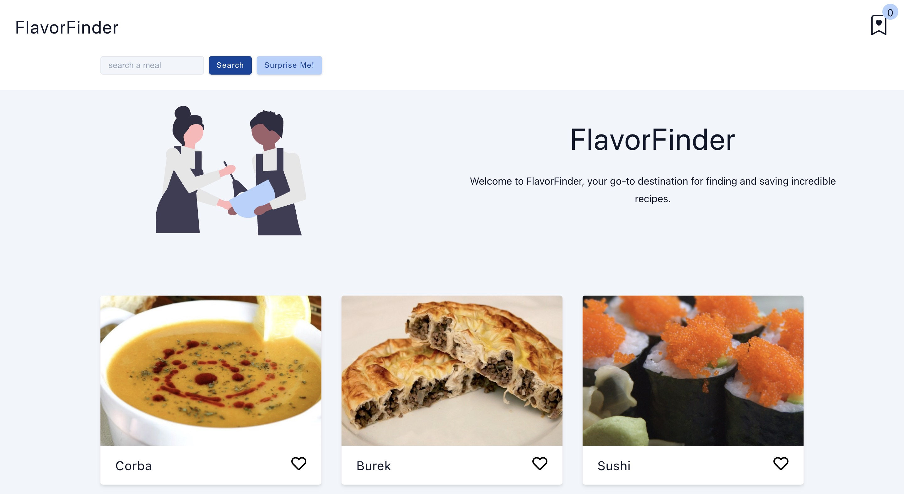

# FlavorFinder

FlavorFinder is a web application that allows users to search for recipes and save their favorite recipes to a personalized favorite list.

## Table of contents

- [Screenshot](#screenshot)
- [Links](#links)
- [My process](#my-process)
  - [Built with](#built-with)
- [Author](#author)

### Screenshot

### Links

- Live Site URL: [here](https://6486c1fb8c6c5218f9e5bd52--venerable-malabi-8e2b41.netlify.app/)

## My process

### Built with

- Semantic HTML5 markup
- CSS custom properties
- Flexbox
- Mobile-first workflow
- [React](https://reactjs.org/) - JS library
- [TheMealDB API](https://www.themealdb.com/api.php)

## Author

- Twitter - [@NotPerry8811](https://www.twitter.com/NotPerry8811)